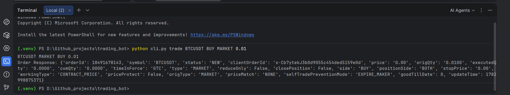
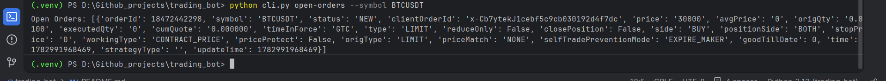

Project Description

    This project is a Python‑based command‑line trading bot that connects to the Binance Futures Testnet. It demonstrates how to integrate with the Binance API,       manage trades programmatically, and build a clean CLI interface using Typer.
    
    The bot allows users to:
    
        Place MARKET and LIMIT orders directly from the terminal
        
        Check open orders to see pending trades
        
        Cancel orders that are no longer needed
        
        Log all trades and errors into a file (trading_bot.log) for tracking
        
    By combining API integration, CLI design, and logging, this project showcases practical backend development skills and real‑world trading workflows. It’s          designed as a recruiter‑ready demo to highlight your ability to work with APIs, handle errors gracefully, and build developer‑friendly tools.

Setup
    
    1.Clone the repo:
         git clone https://github.com/<your-username>/trading_bot.git
         cd trading_bot

    2.Create a virtual environment:
        python -m venv .venv
        .venv\Scripts\activate   # Windows
        source .venv/bin/activate # Linux/Mac

    3.Install dependencies:
        pip install -r requirements.txt
    
    4.Add your Binance Testnet API keys in environment.env:
        API_KEY=your_testnet_api_key
        API_SECRET=your_testnet_secret

Usage

    Place a MARKET order:
        python cli.py trade BTCUSDT BUY MARKET 0.01

    Place a LIMIT order:
        python cli.py trade BTCUSDT BUY LIMIT 0.01 --price 30000

    Check open orders:
        python cli.py open-orders --symbol BTCUSDT

    Cancel an order:
        python cli.py cancel BTCUSDT <orderId>

Example Output

    Order Response: {
      "orderId": 18197619441,
      "symbol": "BTCUSDT",
      "status": "NEW",
      "price": "30000.00",
      "origQty": "0.0100",
      "executedQty": "0.0000",
      "type": "LIMIT",
      "side": "BUY"
    }

Requirements

    Python 3.9+
    python-binance
    typer
    python-dotenv

Project Structure

    trading_bot/
    │── bot/
    │   │── __init__.py
    │   │── client.py
    │   │── logging_config.py
    │   │── orders.py
    │   │── validators.py
    │   │── cli.py
    │── environment.env
    │── README.md
    │── requirements.txt
    │── trading_bot.log
    │── .venv/

Demo

###Placing a Market Order:
Output (Binance Futures Testnet)

    
### Checking Open Orders:
Output (Binance Futures Testnet)

